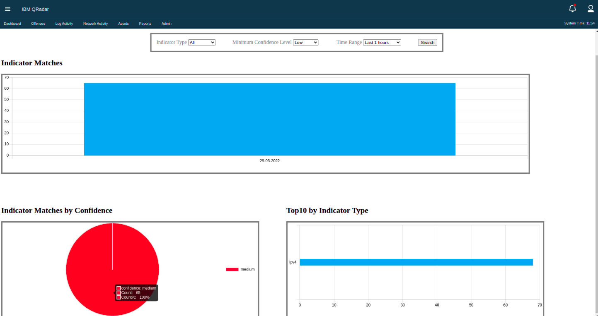
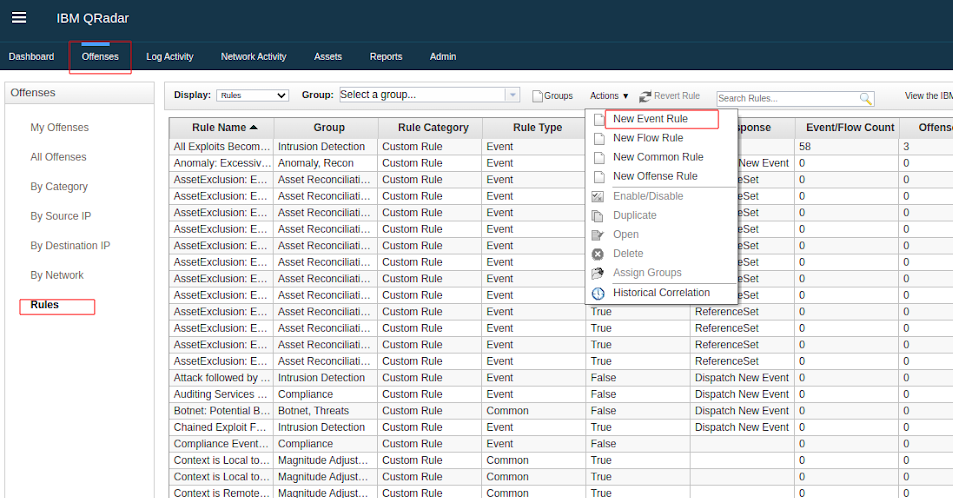
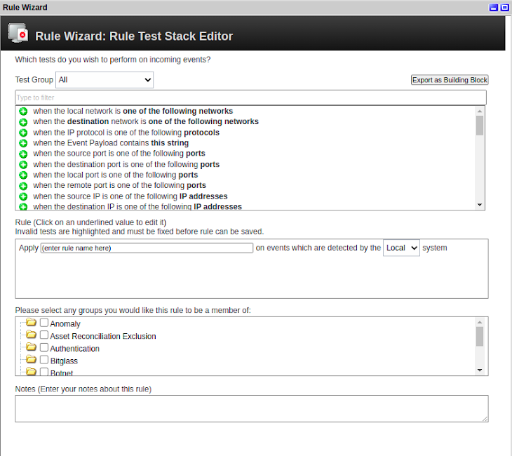
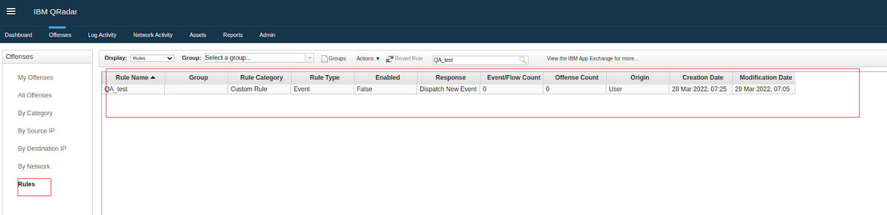
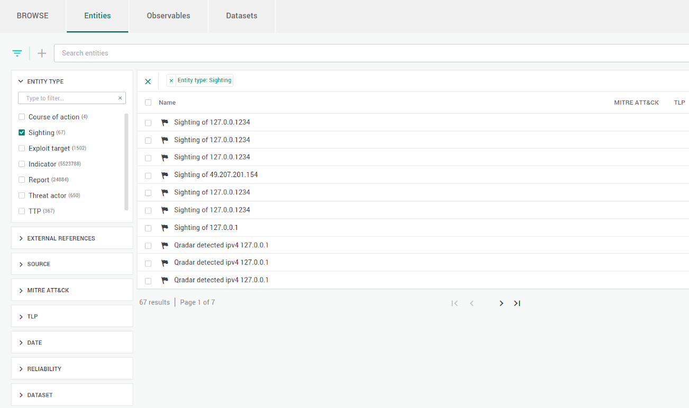

# EclecticIQ Intelligence Center App for QRadar

## 1. Introduction

Follow the instructions here to install and configure
the EclecticIQ Intelligence Center App for QRadar.

**NOTE:**
This document refers to the
**EclecticIQ Intelligence Center App for QRadar**
as **the app** in this document.

Features:

- [Dashboards](#dashboard)
- [Ingest observables from EclecticIQ Intelligence Center](#ingest-observables-from-eclecticiq-intelligence-center)
- [Create sightings on EclecticIQ Intelligence Center](#create-sightings-on-eclecticiq-intelligence-center)
- [Use Event Rules with data](#use-event-rules-with-data)

<!-- markdown-toc start - Don't edit this section. Run M-x markdown-toc-refresh-toc -->
**Table of Contents**

- [EclecticIQ Intelligence Center App for QRadar](#eclecticiq-intelligence-center-app-for-qradar)
    - [1. Introduction](#1-introduction)
    - [Prerequisites](#prerequisites)
    - [Configure EclecticIQ Intelligence Center outgoing feeds](#configure-eclecticiq-intelligence-center-outgoing-feeds)
    - [Install the app](#install-the-app)
        - [Step 1. Download the app from IBM X-Force Exchange](#step-1-download-the-app-from-ibm-x-force-exchange)
        - [Step 2. Navigate to the app and select Extension Management](#step-2-navigate-to-the-app-and-select-extension-management)
        - [Step 3. Browse the file and install the app](#step-3-browse-the-file-and-install-the-app)
        - [Step 4. App should be installed successfully](#step-4-app-should-be-installed-successfully)
    - [Configure the app](#configure-the-app)
        - [Connect to EclecticIQ Intelligence Center](#connect-to-eclecticiq-intelligence-center)
        - [Connect outgoing feeds](#connect-outgoing-feeds)
    - [Features](#features)
        - [Dashboard](#dashboard)
        - [Ingest observables from EclecticIQ Intelligence Center](#ingest-observables-from-eclecticiq-intelligence-center)
        - [Create sightings on EclecticIQ Intelligence Center](#create-sightings-on-eclecticiq-intelligence-center)
        - [Use Event Rules with data](#use-event-rules-with-data)
    - [Appendix](#appendix)
        - [Create custom rules](#create-custom-rules)
        - [Observable lookup](#observable-lookup)
        - [Validate reference tables](#validate-reference-tables)
        - [Manually delete data](#manually-delete-data)
        - [Debug the app](#debug-the-app)

<!-- markdown-toc end -->

## Prerequisites

- IBM QRadar (on-premises) version 7.4.1 FixPack 2 or newer
- An [authorized service token](https://www.ibm.com/docs/en/qradar-common?topic=configuration-creating-authorized-service-token)
  to use with the app
- EclecticIQ Intelligence Center 2.14.0, 3.0.0 or newer,
  configured with the following.
  See [Configure EclecticIQ Intelligence Center outgoing feeds](#configure-eclecticiq-intelligence-center-outgoing-feeds).:
  - One or more outgoing feeds on EclecticIQ Intelligence Center.
  - An EclecticIQ Intelligence Center user account.
  - EclecticIQ Intelligence Center API key

## Configure EclecticIQ Intelligence Center outgoing feeds

The application polls EclecticIQ Intelligence Center
to retrieve observables. To do this,
you must make these observables available
through outgoing feeds.

Each outgoing feed must have following configuration:

| Outgoing feed configuration | Description |
|-----------------------------|-------------|
| Transport type | HTTP download |
| Content type | EclecticIQ Observables CSV |
| Update strategy | Diff or Replace |
| Public | **Do not select.** Only authenticated feeds are supported. |
| Authorized groups | Select one or more groups. See note on **Authorized user** below. |

> **NOTE: Authorized user**
>
> You must have at least one user account for QRadar to use
> to authenticate with EclecticIQ Intelligence Center.
> This user account:
>
> - Is used to generate an API key.
>   This API key is used by the app below.
>
> - Is a member of at least one of the
>   **Authorized groups** configured above.
>
> - Must have these permissions:
>
>   - `read permissions`
>   - `modify entities`
>   - `read extracts`
>   - `read outgoing-feeds`
>   - `read sources`
>   - `read taxonomies`
>
> - Must have permissions to access:
>
>   - All the datasets used in this outgoing feed
>   - Workspaces that these datasets belong to

## Install the app

### Step 1. Download the app from IBM X-Force Exchange

Download the app
from [IBM X-Force
Exchange](https://exchange.xforce.ibmcloud.com):

https://exchange.xforce.ibmcloud.com/hub/extension/3107d1fd9bbe8d3dfc07bd52b8b381fd

### Step 2. Navigate to the app and select Extension Management


### Step 3. Browse the file and install the app


### Step 4. App should be installed successfully


## Configure the app

### Connect to EclecticIQ Intelligence Center

After the installation, configure the app.

1.  From the top navigation, select the **EclecticIQ app** tab
1.  Select the **Setup** tab.
1.  Fill out these fields:

    **NOTE:**
    All fields are required.

    | Field name | Description |
    |------------|-------------|
    | Configuration name | Enter a name for this configuration. |
    | EclecticIQ Host | Enter the API URL of your EclecticIQ Intelligence Center instance. E.g., `https://ic-playground.eclecticiq.com/api/v2` |
    | EclecticIQ API key | Enter the API key used to authenticate with EclecticIQ Intelligence Center. |
    | QRadar Security token | Enter your QRadar [authorized service token](https://www.ibm.com/docs/en/qradar-common?topic=configuration-creating-authorized-service-token). This token must use the **Admin** user role and security profile. |

1.  Select **Test connection** to test your configuration.
1.  When the connection test is successful,
    select **Save** to save this configuration.

### Connect outgoing feeds

Once you've successfully saved the connection configuration,
a new screen is displayed, allowing you to connect to
EclecticIQ Intelligence Center outgoing feeds.

In this configuration view, set the following:

**NOTE:** All fields are required.

| Configuration | Description |
|---------------|-------------|
| Auth User | Default. Do not change. |
| Select one or more outgoing feeds to ingest | Select at least one outgoing feed from the list. Only compatible outgoing feeds are displayed. See section 1.2.1. |
| Select the interval to collect the observables (in seconds) | **Default:** `120`. Minimum is `60`. This application retrieves data from the selected outgoing feeds at this interval.


> **NOTE: Supported observables**
>
> - `email`
> - `ipv4`
> - `uri`
> - `domain`
> - File hashes:
>   `hash-md5`, `hash-sha1`, `hash-sha256`, and `hash-sha512`.

Select **Save** to save your configuration.

## Features

### Dashboard

The application provides 3 dashboards:

- Sightings by time (histogram)
- Sighting by Confidence (bar chart)
- Sighting by type count (bar chart)



### Ingest observables from EclecticIQ Intelligence Center

Once the application is configured
(see [Configure the application](#configure-the-app)),
it periodically performs a one-way sync
to retrieve and ingest observables from the connected
EclecticIQ Intelligence Center.

This one-way sync runs periodically.
When run:
- It checks outgoing feeds at the interval set in
  **Select the interval to collect the observables (in seconds)**.
- The application retrieves observables from outgoing feeds that:

  - Contain new data since the last time it was checked
  - Does not have the "Running" status in EclecticIQ Intelligence Center

- How the app syncs observables from outgoing feeds depending on its
  **Update strategy** set in EclecticIQ Intelligence Center:

    - **Diff:** If outgoing feed was updated
      since the last sync, retrieves newest package
      from outgoing feed and (a) removes data marked as deleted,
      and (b) adds data marked as new.
      If feed initial creation time has changed,
      all existing data from this feed is removed from IBM QRadar,
      and all data is retrieved again.
    - **Replace:** If outgoing feed was updated
      since the last sync, removes all existing data
      on IBM QRadar created by this feed,
      and retrieves all data from this outgoing feed again.


### Create sightings on EclecticIQ Intelligence Center

You can create Sighting entities on EclecticIQ Intelligence Center
from records from the **Log Activity** tab in IBM QRadar.

1.  Go to **Log Activity**, and right-click on a record to create a sighting from.
1.  In the context menu, select **More options > Create EclecticIQ sighting**.
1.  In the window that appears, fill out these fields:

    | Field name | Description |
    |------------|-------------|
    | Sighting value | (Required) This is the value selected from **Log Activity**. An observable with this value is added to the resulting Sighting entity. |
    | Sighting type | (Required) Observable type. Possible values: `ip`, `domain`, `url`, `email`, `hash`. |
    | Sighting title | (Required) Title of resulting Sighting entity. |
    | Sighting description | (Required) Description contained by the resulting Sighting entity. |
    | Sighting confidence | (Required) Confidence assigned to resulting Sighting entity. Possible values: `Low`, `Medium`, `High`. |
    | Sighting tags delimited by comma | Add one or more tags to the resulting Sighting entity. |

1.  Select **Create Sighting**.

### Use Event Rules with data

**NOTE:**
Rules on reference sets over 20K in size can get slow.

The following example creates an alert rule using ingested
threat intelligence data in QRadar:

This rule is connected to Destination IPs in log events and
ingested IP related threat intelligence data.

1.  In QRadar, click the Offenses tab.
1.  Click Rules > Actions > New Event Rule.
1.  In the Rule wizard, select the Events radio button, and
    click Next.
1.  Locate when Reference Table Key data matches any|all
    selected event properties and selected reference table
    column Select operator the value of selected event
    property in the list of tests, and click to add this
    test to the rule.

    * Assign values to place holders by clicking on the
      following underlined parameters:
    * Click Reference Table Key > eiq_data_ip > eiq_value >
      Submit. This creates a rule for IP address matching.
    * Click Selected event properties > Source IP > + >
      Submit.
    * Click Selected reference table column > value >
      Submit.
    * Click Select operator > Equals > Submit.
    * Click Selected event property. For example:
      Destination IP

1.  Filtering on network or log source is strongly
    recommended, as otherwise the Rule can be slow. For
    example,To add the filter of log source:

    * Locate `when the event(s) were detected by one or more
      of these log sources`.
    * Assign values to place holders by clicking on the
      following underlined parameters: Click these log
      sources > Select a log source and click 'Add' >
      Submit. This creates rule for matching when events are
      detected by one or more given log sources.

1.  Click Next.
1.  Select the checkbox for “Ensure the detected event is
    part of an offense”

    * Select ”Index offense based on” according to the
      fields on rule is created. For example if a rule is
      created for matching Destination IP select Destination
      IP.
    * ”Annotate this offense” is optional. User can select
      and add annotations or text explaining the offense.
    * ”Include detected events by Destination IP from this
      point forward, in the offense, for ” is also optional.
      User can mention time interval in seconds to include
      detected events in offense.

1.  Click Finish.
1.  To create the sighting once the offense is created by
    rule,

    1.  User can go to Offenses > All Offenses and can View
        offenses with one of the selected Option: All
        offenses
    1.  Click on any offense.
    1.  Right click on the IP address > Create EclecticIQ
        Sighting
    1.  A pop-up window will appear to ask for the details
        below.

    Clicking on save will create sightings in the EIQ
    platform with provided details.

    * Sighting Value: Value which is clicked
    * Sighting type: Type of sighting. Possible values:
      `ip`, `domain`, `url`, `email`, `hash`
    * Sighting title: Title of sighting
    * Sighting description: Description of sighting
    * Sighting confidence: Confidence of sighting. Possible
      values: low, medium, high
    * Sighting tags delimited by a comma: Any tags to attach
      with sighting









## Appendix

### Create custom rules

See [Creating a custom rule](https://www.ibm.com/docs/en/qsip/7.4?topic=rules-creating-custom-rule).

### Observable lookup

From **Log Activity**, you select observables
and perform a lookup on data retrieved from
EclecticIQ Intelligence Center outgoing feeds.

**NOTE:**
This only works on data already retrieved from
outgoing feeds and ingested in IBM QRadar.

1.  Go to **Log Activity**, and right-click on a record to create a sighting from.
1.  In the context menu, select **More options > Lookup in EclecticIQ Platform**.

A new window appears, displaying all observables retrieved
from EcleticIQ Intelligence Center that match the selected record.

### Validate reference tables

Each outgoing feed creates its own set of
Reference tables, with one table for each observable type:
`domain`, `ip`, `hash`, `email`, and `uri`.

You can inspect these reference tables
by using the `GET /api/reference_data/tables` endpoint
on your IBM QRadar instance,
or use the
[Reference Data Management](https://exchange.xforce.ibmcloud.com/hub/extension/ac45939789c745e6ebfecebc309b1762)
app.

### Manually delete data

**WARNING:**
Deleting data this way is irreversible.

To remove data ingested from outgoing feeds,
either:

1.  Go to the **EclecticIQ app** tab, then select the **Setup** tab.
1.  Re-enter your authorized service token.
1.  Select **Test connection**, then **Save**.
1.  From the list of outgoing feeds in
    **Select one or more outgoing feeds to ingest**,
    you can select **Remove Data** on the right of each
    feed to delete the reference table associated with that feed.

Or:

Manually delete the reference table associated with that feed from IBM QRadar.
You can use the
[Reference Data Management](https://exchange.xforce.ibmcloud.com/hub/extension/ac45939789c745e6ebfecebc309b1762)
app to do this.

### Debug the app

Use the
[recon](https://www.ibm.com/support/pages/qradar-how-use-recon-troubleshoot-qradar-applications)
tool, or follow the instructions here:

1.  Connect to your QRadar instance through SSH.
1.  Find the container ID for the app.
    In the terminal, run as administrator:

    ```bash
    psql -U QRadar -c "select id, name from installed_application;"
    ```

    Take note of the ID of the `EclecticIQ` record (e.g. `1110`).
    This is the app ID.
    
1.  In the terminal, run as administrator:

    ```
    docker ps    
    ```
    
    Find the container whose container name contains
    the app ID found above.
    For example, for an application ID of `1110`,
    we need to find the container named `qapp-1110-XXXXXXX`.

1.  Connect to the container:

    ```
    docker exec -ti <container_name_or_id> bash
    ```

    E.g.:

    ```
    docker exec -ti qapp-1110-XXXXXXX bash
    ```

Once inside the container, you can:

- Inspect logs in `/opt/app-root/store/log`
- Inspect configuration files: `/opt/app-root/store`

  - `checkpoint.txt`: Last recorded state of connected outgoing feeds.
  - `data.json`: Main configuration file for application.
  - `setup.json`: Configuration for outgoing feed ingestion and poll frequency.
